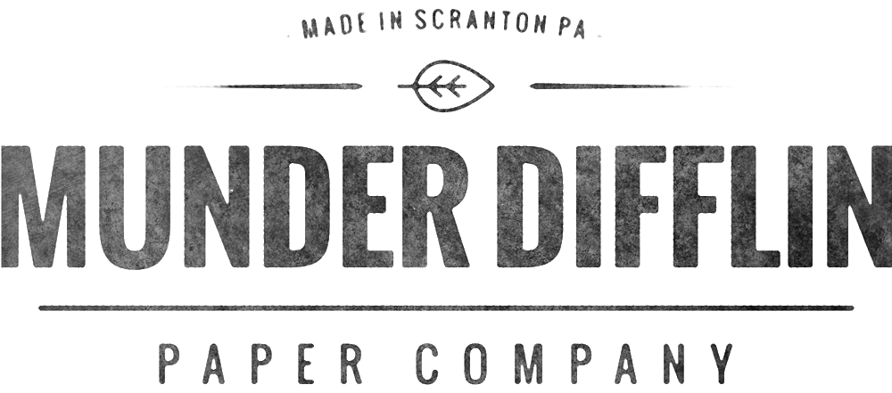

# Munder Difflin
###### 
## Motivation
###### Munder Difflin is an imaginary papercompany, inspired by a different imaginary(yet somehow _more_ real) paper company. This project is an effort to give their brand a digital face lift, and draw in  new clients. This is a simple build out to showcase some techniques and possibilities for the finished product. 
## Build Status
###### This page is the MVP, minimum viable product. I would like to overhaul the design, and add more pages, with more animations and more DOM manipulation to improve the overall experience of using the page. I created a checklist of minimum standards to meet, met them, and now am prepared to evaluate towards a more polished finished product. 
## Code Style
###### I am working on cleaning up my markup structure, implementing best practices, and scanning my code for redundancies. So far most of the edits on that front have been through inheritance related mistakes.  
## Technology Used
###### To make this simple web page, I employed HTML5 CSS3 and simple JavaScript DOM manipulation.
## Features
###### The website has an expandable menu, animated banner drop on page load, and clickable photos that drop down text snippets.
## Code Example
###### Below is the JavaScript I used to make the photo drop downs activate on click. 
```javascript
let collapse = document.getElementsByClassName("collapsible");
let i;
for (i = 0; i < collapse.length; i++) {
    collapse[i].addEventListener("click", function() {
        this.classList.toggle("active");
        let content = this.nextElementSibling;
        if (content.style.display === "block") {
            content.style.display = "none";
        } else {
            content.style.display = "block";
        }
    });
}
```
## How To Use
###### Click around, scroll, and please give me constructive feedback or critique. 
## Credit
###### This project would not be possible without the CSS, HTML, and JavaScript tutorials available at [w3C Schools](https://www.w3schools.com/). Also, [CSS Tricks](https://css-tricks.com) was pivotal in my design and styling implementation.The typeface, which I very much enjoy was found at [Google Fonts](https://fonts.google.com/). All images are liscenced by Creative Commons from [Pexels](https://www.pexels.com/).
## Licence
##### IT License

###### Copyright &copy; [2018] [Joshua Seyda]

###### Permission is hereby granted, free of charge, to any person obtaining a copy
of this software and associated documentation files (the "Software"), to deal
in the Software without restriction, including without limitation the rights
to use, copy, modify, merge, publish, distribute, sublicense, and/or sell
copies of the Software, and to permit persons to whom the Software is
furnished to do so, subject to the following conditions:

###### The above copyright notice and this permission notice shall be included in all
copies or substantial portions of the Software.

###### THE SOFTWARE IS PROVIDED "AS IS", WITHOUT WARRANTY OF ANY KIND, EXPRESS OR
IMPLIED, INCLUDING BUT NOT LIMITED TO THE WARRANTIES OF MERCHANTABILITY,
FITNESS FOR A PARTICULAR PURPOSE AND NONINFRINGEMENT. IN NO EVENT SHALL THE
AUTHORS OR COPYRIGHT HOLDERS BE LIABLE FOR ANY CLAIM, DAMAGES OR OTHER
LIABILITY, WHETHER IN AN ACTION OF CONTRACT, TORT OR OTHERWISE, ARISING FROM,
OUT OF OR IN CONNECTION WITH THE SOFTWARE OR THE USE OR OTHER DEALINGS IN THE
SOFTWARE.


